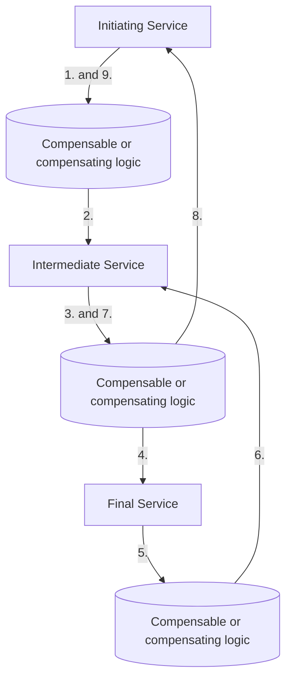
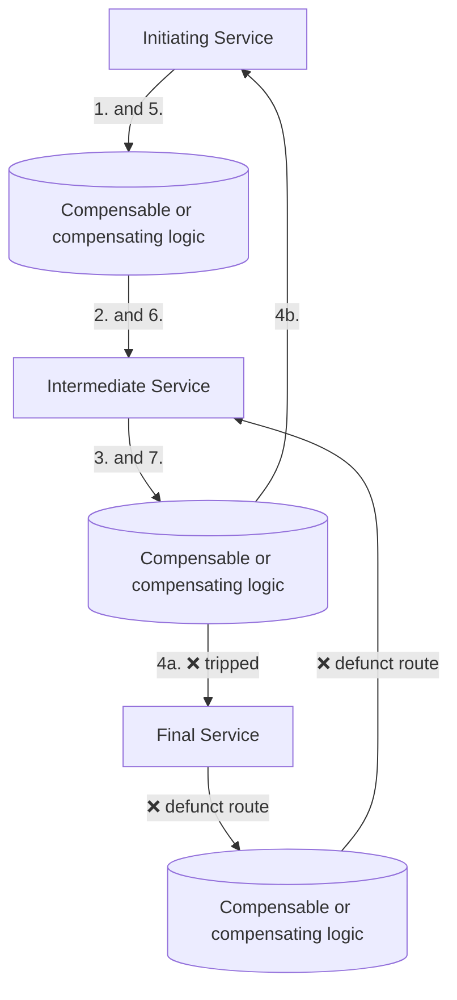
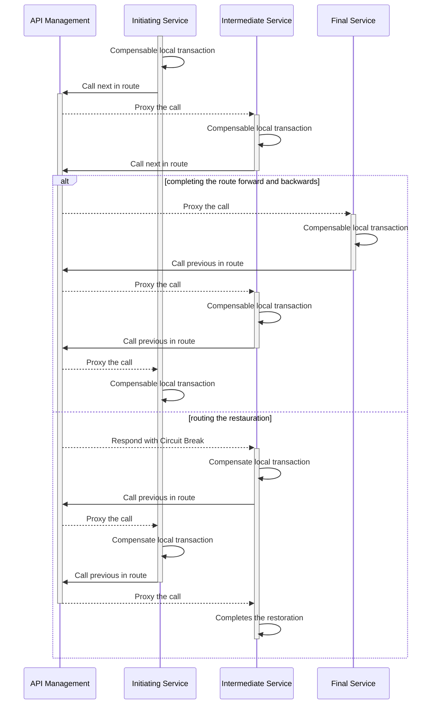
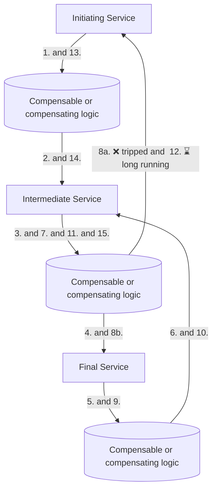

# Circuit Choreography

[![CC BY-NC-SA 4.0][cc-by-nc-sa-shield]][cc-by-nc-sa]

## Introduction

The Circuit Choreography pattern defines a choreographic message flow that maintains a closed circuit at all times.

The pattern takes concepts from the [Compensating Transaction pattern](https://learn.microsoft.com/en-us/azure/architecture/patterns/compensating-transaction), [Circuit Breaker pattern](https://learn.microsoft.com/en-us/azure/architecture/patterns/circuit-breaker), [Saga distributed transactions pattern](https://learn.microsoft.com/en-us/azure/architecture/reference-architectures/saga/saga) and [Choreography pattern](https://learn.microsoft.com/en-us/azure/architecture/patterns/choreography) and essentially combines them into a robust and modern design pattern.

## Rules

The following rules must be applied to implement Circuit Choreography:

1. Any service handles atomic operations independently.
2. A forward routing is the choreography that moves to one or more subsequent services and starts at the initiating service and completes at the final service.
3. A backward routing is the choreography that moves back in opposite order and starts at the final service and completes at the initiating service.
4. A restoration routing is the choreography that replaces both forward and backward routing, in case of an open circuit (initialized by a circuit breaker), and starts at the current service and completes at that same service.
5. A restoration routing reverses the route and demands compensation from the preceding service, which in turn demands compensation from the next preceding service until the start of the restoration routing is reached.
6. If a restoration routing fails moving to a next service, it activates a long running process that keeps trying to go in the same reversed order it started.
7. The choreography maintains a closed circuit at all times, meaning: there is always a forward and backward route that completes. If they cannot complete, the circuit has to be restored by a restoration route.

Optionally:

1. To ensure exactly once delivery, consider implementing [the Inbox and outbox pattern](https://en.wikipedia.org/wiki/Inbox_and_outbox_pattern) at each service.

## Choreography in a closed circuit

What if everything just works? There will be a route forward and a route backwards that both complete.

*- Routing forward:*

1-2: Initiating Service transacts the way forward and calls the Intermediate Service.

3-4: Intermediate Service transacts and calls the Final Service.

5: Final Service transacts and completes the way forward.

*- Routing backwards:*

6: Final Service transacts the way backwards and calls the Intermediate Service.

7-8: Intermediate Service transacts and calls the Initiating Service.

9: Initiating Service transacts and completes the way backwards.

## Choreography restoration from an open circuit routing forwards

What if we trip the circuit at step 4? The Final Service failed on the forward route, so the Intermediate Service handles a restoration route by reversing and demanding compensation.

*- Routing forward:*

1-2: Initiating Service transacts the way forward and calls the Intermediate Service.

3-4a: Intermediate Service transacts and calls the Final Service.

4a: Final Service tripped.

*- Routing the restoration:*

4b: Intermediate Service compensates and calls the Initiating Service.

5-6: Initiating Service compensates and calls the Intermediate Service.

7: Intermediate Service transacts and completes the restoration.

### As a sequence with API Management

The following sequence diagram displays the choreography restoration from an open circuit routing forwards, as the second alternative path, in an architecture with API Management placed as a proxy to front the services to provide [Circuit breaker functionality like Azure API Management implements](https://learn.microsoft.com/en-us/azure/api-management/backends?tabs=bicep#circuit-breaker).

## Choreography restoration from an open circuit routing backwards

What if we trip the circuit at step 8? The Initiating Service failed at the backwards route, so the Intermediate Service handles a restoration route by reversing and demanding compensation. It has to create a long running operation to close the circuit again.

*- Routing forward:*

1-2: Initiating Service transacts the way forward and calls the Intermediate Service.

3-4: Intermediate Service transacts and calls the Final Service.

5: Final Service transacts and completes the way forward.

*- Routing backwards:*

6: Final Service transacts the way backwards and calls the Intermediate Service.

7-8a: Intermediate Service transacts and calls the Initiating Service.

8a: Initiating Service tripped.

*- Routing the restoration:*

8b: Intermediate Service compensates and calls the Final Service.

9-10: Final Service compensates and calls the Intermediate Service.

11-12: Intermediate Service compensates and starts a long running compensation operation on the Initiating Service.

13-14: Initiating Service restored operations, compensates and calls the Intermediate Service.

15: Intermediate Service transacts and completes the restoration.

## License

This work is licensed under a
[Creative Commons Attribution-NonCommercial-ShareAlike 4.0 International License][cc-by-nc-sa].

[![CC BY-NC-SA 4.0][cc-by-nc-sa-image]][cc-by-nc-sa]

[cc-by-nc-sa]: http://creativecommons.org/licenses/by-nc-sa/4.0/
[cc-by-nc-sa-image]: https://licensebuttons.net/l/by-nc-sa/4.0/88x31.png
[cc-by-nc-sa-shield]: https://img.shields.io/badge/License-CC%20BY--NC--SA%204.0-lightgrey.svg